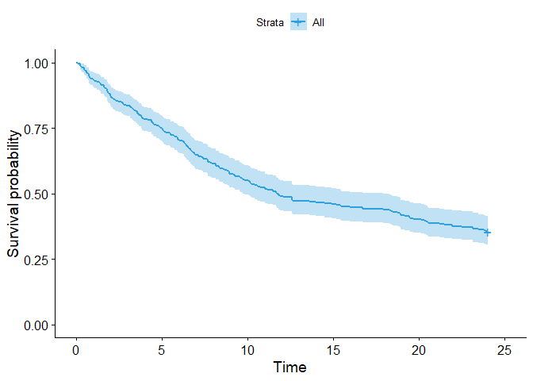
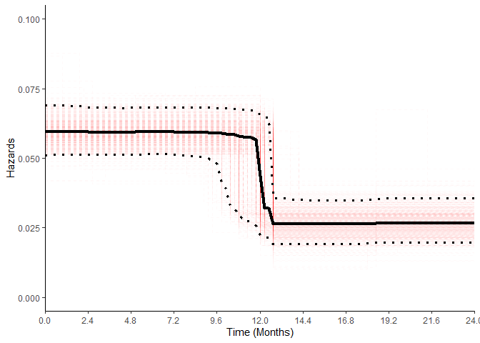
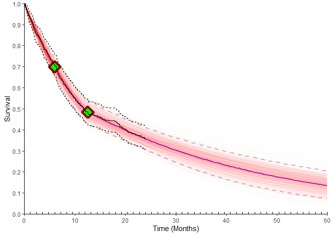
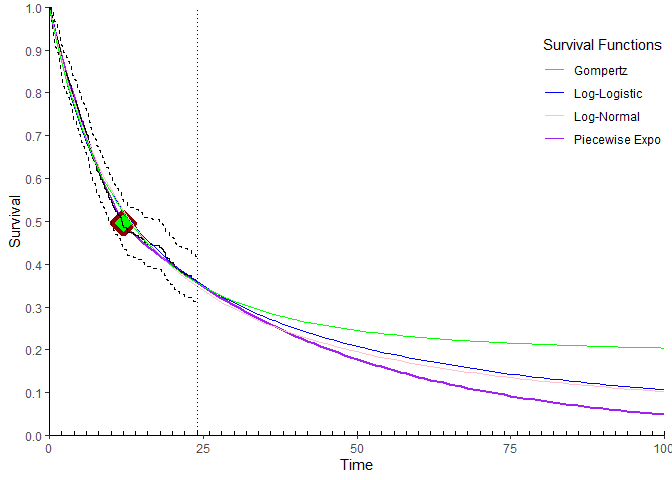

README
================

# Overview of PiecewiseChangepoint package

<!-- bookdown::html_document2: default -->
<!-- bookdown::pdf_document: default -->

The goal of PiecewiseChangepoint is to estimate the number and locations
of change-points in piecewise exponential models.

## Installation

You can install the released version of PiecewiseChangepoint from
[GitHub](https://github.com/Anon19820/PiecewiseChangepoint) with:

``` r
devtools::install_github("Anon19820/PiecewiseChangepoint")
```
or install the binary zip file ``https://github.com/Anon19820/PiecewiseChangepoint/blob/main/PiecewiseChangepoint_1.0.zip''.


## Simulated Example

First we load the package and simulate some piecewise exponential data.

    library("PiecewiseChangepoint")

    ## simulated example
    set.seed(123)
    n_obs =20
    n_events_req=20
    max_time =  24 # months

    rate = c(0.75,0.25)/12 # we want to report on months
    t_change =12 # change-point at 12 months

    df <- gen_piece_df(n_obs = n_obs,n_events_req = n_events_req,
                       num.breaks = length(t_change),rate = rate ,
                       t_change = t_change, max_time = max_time)
                       

We see the output of this dataframe below:

    ##     time_event status       time
    ## 24  0.09194727      1 0.09194727
    ## 193 0.23141129      1 0.23141129
    ## 87  0.24251702      1 0.24251702
    ## 126 0.25450622      1 0.25450622
    ## 297 0.28833655      1 0.28833655
    ## 139 0.32615105      1 0.32615105

For this simulated dataset; *time_event* represents the time the event
would occur at in the absence of censoring, while *time* is minimum of
the censoring time and the event time. *status* is an indicator variable
if the event occurred at the corresponding time or if it was censored.
Plotting this survival function we see a potential change in the hazard
at around year 1.

<!-- -->

As noted in ([Bagust and Beale 2014](#ref-Bagust.2014)), constant
hazards are linear with respect to the cumulative hazard function,
therefore, the change in hazards at approximately 12 months can be seen
more clearly in this plot.

``` r
ggsurvplot(fit, palette = "#2E9FDF", fun = "cumhaz")
```

<!-- -->

Next we fit the model noting that only the time and status columns are
required. The timescale argument changes the prior for the hazards
$\lambda$ so that it is appropriate for the timescale. For example if
the timescale is years then the a vague prior centered around 1 is
appropriate (i.e. $36\%$ of population having the event each year),
while if the timescale is in months the equivalent prior should have an
expected value of 1/12 (and days 1/365).


    Collapsing_Model <- collapsing.model(df,
                                         n.iter = 20750,
                                         burn_in = 750,
                                         n.chains = 2,
                                         timescale = "months")

                          

As we would expect the one change-point model has the highest posterior
probability.

    print(Collapsing_Model)

``` r
print(Collapsing_Model)
```

    ## Posterior Change-point Probabilities:
    ##        0         1         2         3         4         5  
    ## 0.000575  0.809525  0.166000  0.020650  0.002850  0.000400  
    ## 
    ## Summary of 1 change-point model:
    ## 
    ##   changepoint_1      lambda_1           lambda_2         
    ##   Min.   : 1.873     Min.   :0.04206    Min.   :0.01170  
    ##   1st Qu.:11.701     1st Qu.:0.05614    1st Qu.:0.02355  
    ##   Median :11.900     Median :0.05940    Median :0.02652  
    ##   Mean   :11.857     Mean   :0.05954    Mean   :0.02682  
    ##   3rd Qu.:12.603     3rd Qu.:0.06277    3rd Qu.:0.02983  
    ##   Max.   :19.457     Max.   :0.08456    Max.   :0.04832

<!-- We should investigate the mixing of the chains to ensure they are satisfactory. The plot below indicates that is the case with jumps between models occurring frequently. This is an advantage of the method as other methods such as Reversible Jump Markov Chain Monte Carlo (RJMCMC) [@Green.1995] require careful consideration of a bijective function to move between model dimensions. Often it is difficult to find such an appropriate bijective function which provides frequent jumps between models and therefore convergence can be quite slow.    -->
<!-- ```{r} -->
<!-- chain.mixing(Collapsing_Model) -->
<!-- ``` -->

Once we are satisfied that there is good mixing and that we have run the
model for long enough (20,000 simulations over 2 chains should be more
than enough), we may want to look at a plot of the survivor function. In
health economics we are typically interested in long term survival of
our parametric models. In this situation we want a plot of the first 5
years which we can do using the *max_predict* argument (in this case 60
months). The red lines show the individual posterior simulations and are
a natural representation of the parameter uncertainty.

``` r
plot(Collapsing_Model, max_predict = 60, chng.num = 1)+xlab("Time (Months)")
```

<!-- -->

Similarly we may also want to look at the hazard function. In this
situation we only present the hazard up to the maximum time observed in
the data. This is because by definition the hazard from the final
interval will be the one which is extrapolated throughout the time
horizon.

``` r
plot(Collapsing_Model, type = "hazard")+xlab("Time (Months)")+ylab("Hazards")+ylim(c(0,.1))
```

    ## Scale for y is already present.
    ## Adding another scale for y, which will replace the existing scale.

<!-- -->

By default the plot methods described above use all the posterior
simulations. If for example, we were only interested in the 2
change-point model, we can specify this using the *chng.num* argument.
The green points indicate the mean location of the change-points. When
plotting “all” of the simulations there is no sensible mean location of
the change-points as there are different numbers of change-points.

``` r
plot(Collapsing_Model, max_predict = 60, chng.num = 2)+xlab("Time (Months)")
```

<!-- -->

## Comparison with other survival models

### Assessment of Goodness of Fit

In health economics we are typically interested in picking between one
of a number of alternative parametric models, although it is also
possible to combine all models using model averaging ([Jackson,
Sharples, and Thompson 2010](#ref-Jackson.2010)). Model fit statistics
can provide an assessment of fit to the **observed** data, although,
they do not guarantee the best fitting model will be appropriate for
extrapolation. Nevertheless, we can compare our fitted model with 6
commonly used parametric models along with Royston-Parmar spline models.
We fit the models using the JAGS ([Plummer 2003](#ref-Plummer.2003)) and
Stan ([Stan Development Team, n.d.](#ref-RStan.2023)) and compare the
model fit using Widely Applicable Information Criterion (WAIC)
([Watanabe 2010](#ref-Watanabe.2010)).

### Including General Population Mortality

Including General Population Mortality (GPM) is required to ensure that
the extrapolated hazards are consistent with the increasing hazards
associated with advanced ageing. Adjustments for GPM is typically done
within the cost-effectiveness model, however, we can include them
directly at the analysis stage so that we see their impact on the
extrapolated survival.

In this example we consider GPM from a UK data source which provides
mortality rates, defined as “the probability of that a person aged
exactly $x$ will die before reaching $x+1$". Therefore, this data source
provides the conditional probability of death within a year at each age.

Assuming our population is $50%$ male and female and the age at baseline
is 55 years we have the following conditional probabilities of death at
each age:

``` r
age_baseline_example <- 55
prop_male <- 0.5
time_horizon <- 100 

Conditional_Death_df <- read.xlsx(paste0(pathway, "Examples/Conditional_Death_UK.xlsx"), 1) %>% 
                          filter(age >=age_baseline_example)
head(Conditional_Death_df)
```

    ##   age Males..2018.2020. Females.2018.2020
    ## 1  55          0.005046          0.003283
    ## 2  56          0.005593          0.003637
    ## 3  57          0.006060          0.003928
    ## 4  58          0.006695          0.004367
    ## 5  59          0.007239          0.004707
    ## 6  60          0.007912          0.005247

Our timescale is months and we need to convert this annual probability
to a monthly rate which is done using the following formula (assuming a
constant rate of mortality) ([Fleurence and Hollenbeak
2007](#ref-Fleurence.2007)):

$$r = \frac{1}{t}\ln(1-p).$$ Because there are 12 months in a year
$t = 12$ and $p$ is the specific (in our case annual) probability of
death. With the below R code we now have the monthly rate of death for
ages 55 (our assumed starting age of the cohort) up to 100 years of age,
adjusted for distribution of males and females.

``` r
time_factor <- 12
Conditional_Death_df_temp <- Conditional_Death_df
Conditional_Death_df_temp[, "mix_prob"] <- Conditional_Death_df_temp[,2]*prop_male + Conditional_Death_df_temp[,3]*(1-prop_male)
Conditional_Death_df_temp <- Conditional_Death_df_temp %>% filter(age >= age_baseline_example & age <= time_horizon)

Conditional_Death_df_temp$mix_haz <- -log(1-Conditional_Death_df_temp$mix_prob)/time_factor

gmp_haz_vec_example = rep(Conditional_Death_df_temp$mix_haz,each = time_factor)
#We now have the hazard at each timepoint
gmp_haz_df_example <- data.frame(time = 1:length(gmp_haz_vec_example), hazard = gmp_haz_vec_example)
```

Within the `compare.surv.mods` function the cumulative hazard of death
(associated with GPM) and cumulative hazard of an event (from the
parametric model) is added to obtain the overall cumulative hazard
$H(t)$. The cumulative hazard is the sum (in the case of discrete
hazards as above) of the individual hazards and the integral of the
parametric hazards. Survival probabilities are obtained through the
relation $S(t) = \exp(-H(t))$. By default the `compare.surv.mods`
function only implements GPM hazards after follow-up as we observe
survival from all causes up until then (although GPM hazards can be
added from start of follow-up by using the `gpm_post_data = FALSE`).

We see in the plot below that including the GPM hazard ensures that the
extrapolated hazard exhibits the characteristic increasing hazards
associated with ageing.

``` r
gmp_haz_df_example_plt <- gmp_haz_df_example %>% filter(time > 24) #Extrapolated Hazard
#Find final constant hazard used for extrapolation 
extrapolated_haz <- colMeans(Collapsing_Model$lambda[apply(Collapsing_Model$lambda,1, function(x){length(na.omit(x))==2}),])[2]
plot(gmp_haz_df_example_plt$time/12 + age_baseline_example, 
     y =  gmp_haz_df_example_plt$hazard +extrapolated_haz, col = "red",
     ylim= c(0, max(gmp_haz_df_example_plt$hazard +extrapolated_haz)*1.1), type = "l",
     xlab = "Age",
     ylab = "(Monthly) Hazard")
lines(gmp_haz_df_example_plt$time/12 + age_baseline_example, y =  gmp_haz_df_example_plt$hazard, col = "blue") #GMP
legend("topleft", legend=c("Extrapolated hazard - Constant Disease-specific + GPM hazard", "GPM hazard"),
       col=c("red", "blue"), lty=1:2, cex=0.8)
```

<!-- -->

### Fitting of Standard Parametric models and Plot of Extrapolated Survival

The fitting of other parametric models is accomplished by the
`compare.surv.mods` and general population mortality is adjusted for by
including a `gmp_haz_df` as described above. Fitted models include:

-   Exponential
-   Weibull
-   Gamma
-   Gompertz
-   Generalized Gamma
-   Royston-Parmar Spline (best fitting by WAIC between 1 and 2 knot)

Model fit to the observed data and a plot of the extrapolated survival
are available from within the `mod_comp` object along with the posterior
samples from all of the fitted models.

    #This can take a number of minutes 
    set.seed(123)
    mod_comp <- compare.surv.mods(Collapsing_Model, max_predict = 100, #100 months
                                                       n.iter.jags = 5000, #Run JAGS/Stan for 5000 samples
                                                       n.thin.jags = 1,
                                                       n.burnin.jags = 500,
                                                       chng.num = 1, #Using results from 1 change-point PEM
                                                       gmp_haz_df =gmp_haz_df_example) #GPM dataset 


    mod_comp$mod.comp[,c(1,3)]

    mod_comp$plot_Surv_all

``` r
#Returns a dataframe with the model fit results
mod_comp$mod.comp[,c(1,3)] %>% arrange(WAIC)
```

    ##                   Model     WAIC
    ## 1 Piecewise Exponential 1547.589
    ## 2            Log-Normal 1552.323
    ## 3          Log-Logistic 1553.211
    ## 4              Gompertz 1553.251
    ## 5 Royston-Parmar 2 knot 1553.756
    ## 6     Generalized Gamma 1556.377
    ## 7               Weibull 1561.826
    ## 8                 Gamma 1564.009
    ## 9           Exponential 1568.012

``` r
mod_comp$plot_Surv_all
```

    ## `geom_line()`: Each group consists of only one observation.
    ## ℹ Do you need to adjust the group aesthetic?

<!-- -->

``` r
#Returns plot of extrapolated survival
mod_comp$plot_Surv_all
```

    ## `geom_line()`: Each group consists of only one observation.
    ## ℹ Do you need to adjust the group aesthetic?

<!-- -->


# References

<div id="refs" class="references csl-bib-body hanging-indent">

<div id="ref-Bagust.2014" class="csl-entry">

Bagust, Adrian, and Sophie Beale. 2014. “Survival Analysis and
Extrapolation Modeling of Time-to-Event Clinical Trial Data for Economic
Evaluation: An Alternative Approach.” *Medical Decision Making* 34 (3):
343–51. <https://doi.org/10.1177/0272989X13497998>.

</div>

<div id="ref-Fleurence.2007" class="csl-entry">

Fleurence, Rachael, and Christopher Hollenbeak. 2007. “Rates and
Probabilities in Economic Modelling: Transformation, Translation and
Appropriate Application.” *PharmacoEconomics* 25 (February): 3–6.
<https://doi.org/10.2165/00019053-200725010-00002>.

</div>

<div id="ref-Gorrod.2019" class="csl-entry">

Gorrod, Helen Bell, Ben Kearns, John Stevens, Praveen Thokala, Alexander
Labeit, Nicholas Latimer, David Tyas, and Ahmed Sowdani. 2019. “<span
class="nocase">A Review of Survival Analysis Methods Used in NICE
Technology Appraisals of Cancer Treatments: Consistency, Limitations,
and Areas for Improvement</span>.” *Medical Decision Making* 39 (8):
899–909.

</div>

<div id="ref-Jackson.2010" class="csl-entry">

Jackson, C. H., L. D. Sharples, and S. G. Thompson. 2010. “<span
class="nocase">Structural and parameter uncertainty in Bayesian
cost-effectiveness models</span>.” Journal Article. *J R Stat Soc Ser C
Appl Stat* 59 (2): 233–53.
<https://doi.org/10.1111/j.1467-9876.2009.00684.x>.

</div>

<div id="ref-Plummer.2003" class="csl-entry">

Plummer, Martyn. 2003. “JAGS: A Program for Analysis of Bayesian
Graphical Models Using Gibbs Sampling.” *3rd International Workshop on
Distributed Statistical Computing (DSC 2003); Vienna, Austria* 124
(April).

</div>

<div id="ref-RStan.2023" class="csl-entry">

Stan Development Team. n.d. “RStan: The R Interface to Stan.”
<https://mc-stan.org/>.

</div>

<div id="ref-TA268" class="csl-entry">

TA268. 2012. “<span class="nocase">Ipilimumab for previously treated
advanced (unresectable or metastatic) melanoma: Technology Appraisal
Guidance</span>.” *NICE*. <https://www.nice.org.uk/guidance/ta268>.

</div>

<div id="ref-Watanabe.2010" class="csl-entry">

Watanabe, Sumio. 2010. “Asymptotic Equivalence of Bayes Cross Validation
and Widely Applicable Information Criterion in Singular Learning
Theory.” *J. Mach. Learn. Res.* 11 (December): 3571–94.

</div>

</div>
